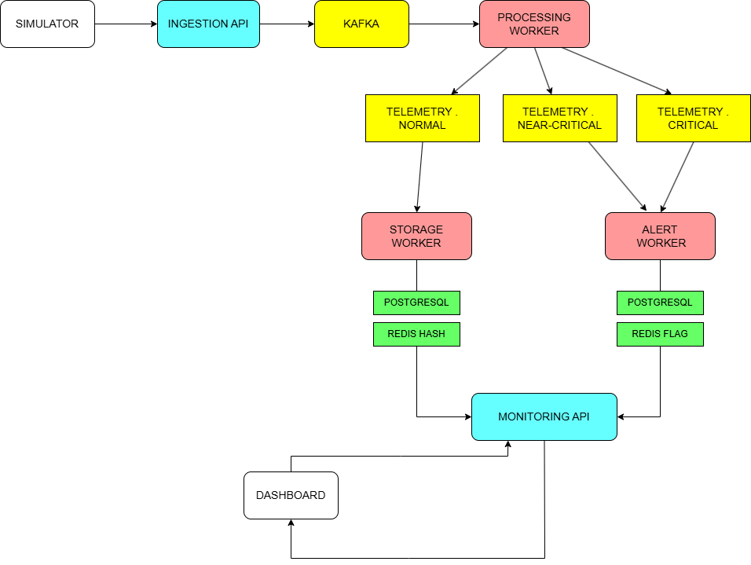

# TelSys: Real-Time IoT Telemetry Processing System

TelSys is a distributed backend system for ingesting, processing, and monitoring real-time telemetry data from IoT devices.

## Architecture



Each service is independently deployable and communicates asynchronously over Kafka.

## Modules

- **ingestion-api** (8081) — Receives telemetry packets, applies per-device rate limiting via Redis, publishes to Kafka
- **processing-worker** (8082) — Consumes raw packets, classifies severity, persists to DB, updates Redis device state
- **monitoring-api** (8083) — REST + SSE API for querying telemetry, devices, and alerts
- **alert-worker** (8084) — Consumes critical/near-critical topics, creates deduplicated alerts
- **simulator** — Simulates 3 IoT devices sending telemetry every 3 seconds
- **common** — Shared models, DTOs, enums, and exceptions

## Tech Stack

- Java 24, Spring Boot 3
- Apache Kafka (KRaft mode)
- PostgreSQL 16
- Redis 8
- Docker & Docker Compose
- Micrometer + Prometheus
- JUnit 5, Mockito

## How to Run

```bash
git clone https://github.com/Flicko75/telemetry-system.git
cd telsys
docker compose up --build
```

Requires Docker and Docker Compose installed. All services start automatically.

## API Endpoints

### Ingestion API (8081)
- POST /api/v1/telemetry

### Monitoring API (8083)
- GET  /api/v1/telemetry
- GET  /api/v1/telemetry/{deviceId}
- GET  /api/v1/telemetry/{deviceId}/range
- GET  /api/v1/devices/{deviceId}/live  (SSE)
- PATCH /api/v1/devices/{deviceId}
- GET  /api/v1/alerts/{deviceId}
- PATCH /api/v1/alerts/{alertId}

Full API documentation available at:
- `http://localhost:8081/swagger-ui.html`
- `http://localhost:8083/swagger-ui.html`

## Testing

- 70+ unit tests covering classification logic, service layer, and controllers
- Run with: `mvn test`